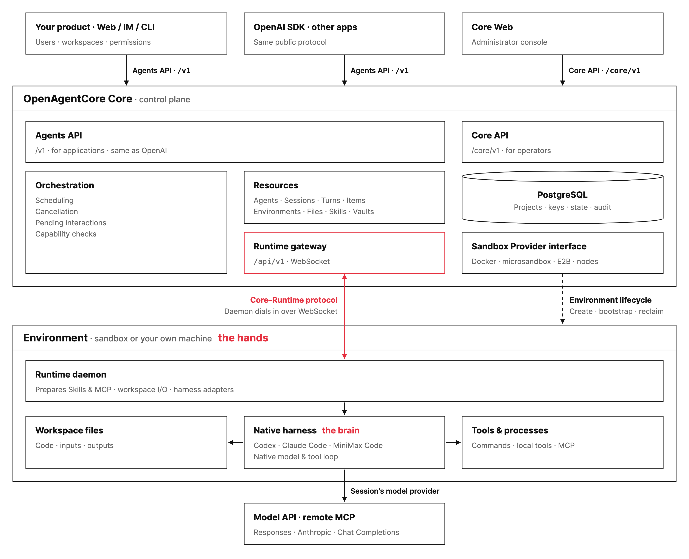
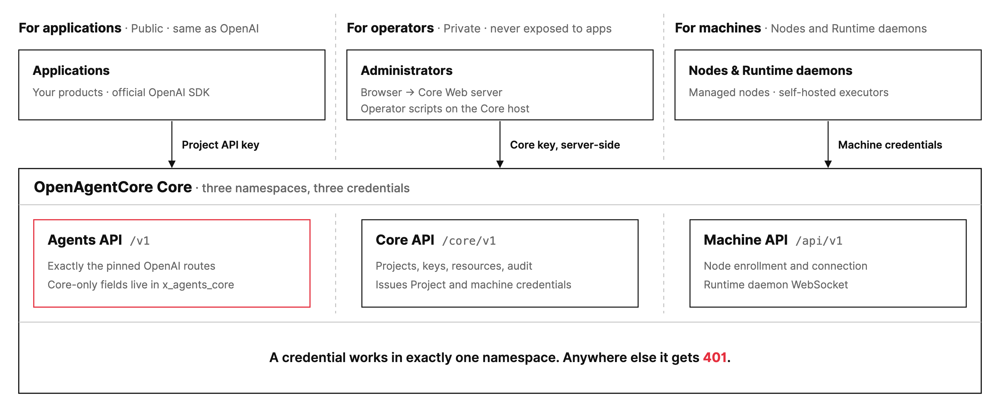
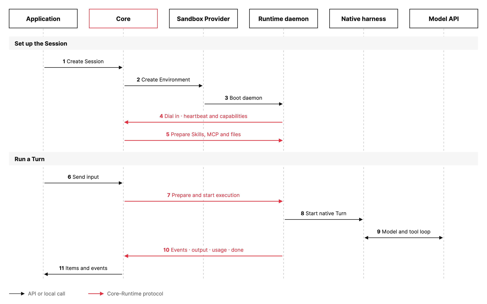

# Architecture

OpenAgentCore separates control, runtime and execution. Core owns durable state
and the API; the Runtime daemon runs work inside an Environment; the native harness
keeps its own model and tool loop. Each connection between them is a defined
protocol, so any part can be replaced without changing Core orchestration.

This page is a map. Each section names a component, its boundary and the document
that owns its rules.

The diagram has four tiers:

1. **Callers.** Applications, including your product and the official OpenAI SDK,
   call the Agents API. Operators use Core Web, which calls the Core API.
2. **Core.** The control plane: public and administrator APIs, resources,
   orchestration, PostgreSQL, the Runtime gateway and the Sandbox Provider
   interface.
3. **Environment.** Where the agent works: a Core-managed sandbox or your own
   machine. The Runtime daemon prepares capabilities and starts the native harness,
   which works on the workspace and tools.
4. **Outside Core.** The model API and remote MCP servers, called by the harness
   with the Session's model provider.

## Two APIs, and a machine channel

Core serves three namespaces. Each has one kind of caller and its own credential;
a credential used in another namespace gets 401.

| Namespace | Caller | Credential | Purpose |
| --- | --- | --- | --- |
| Agents API, `/v1` | Applications and the official SDK | Project API key | Exactly the pinned OpenAI Agents API routes. Core-only fields live in `x_agents_core` |
| Core API, `/core/v1` | Core Web's server and operator scripts | Core key | Projects and keys, resource reads and deletion, audit, nodes, metrics and deployment settings |
| Machine API, `/api/v1` | Sandbox nodes and Runtime daemons | Machine credentials issued through `/core/v1` | Node enrollment and connection, Runtime daemon WebSocket |

The browser never receives the Core key: Web keeps it on its server and forwards
signed-in `/core/v1` requests. The reverse proxy sends `/v1` and `/api/v1` to Core
and everything else to Web. The [API index](api/README.md) owns the complete
route and credential matrix; [design principles](design-principles.md) explain
Projects, keys and administrator authority.

## Core

Core is the only owner of durable execution facts: Projects and keys, Agents,
Sessions, Turns, Items, Environments, files and audit records, all in PostgreSQL.
It schedules Turns, handles cancellation and pending interactions, and checks that
a requested harness, Environment and capability combination is supported before
starting work.

Core does not isolate tools, run a model or talk to a vendor SDK directly. It
selects implementations through interfaces and never branches on a harness,
operating system or provider name. See
[the decoupling principle](../CONTRIBUTING.md#decoupling-principle) and the
[repository map](development.md#repository-map).

## Replaceable parts

| Part | Responsibility | Connects through | Current implementations | Add one |
| --- | --- | --- | --- | --- |
| Sandbox Provider | Creates, bootstraps, renews and reclaims the outer Environment | `SandboxProvider` interface | Docker, microsandbox, E2B, sandbox nodes | [Sandbox Provider guide](sandbox-provider.md) |
| Runtime | Prepares Skills, MCP and files, runs executors, owns local cleanup | Core–Runtime protocol over `/api/v1` | `oac-daemon`, managed or self-hosted on Linux, macOS and Windows | [Core–Runtime protocol](runtime-protocol.md) |
| Harness | Runs the native model and tool loop | Harness adapter (`Executor` and `Turn`) | Codex, Claude Code, MiniMax Code | [Harness onboarding](../contracts/agents-api/harness-onboarding.md) |
| Model Provider | Serves inference for the harness | Responses, Anthropic or Chat Completions protocol | Any endpoint speaking one of those protocols | [Model execution](../contracts/agents-api/model-execution.md) |

Replaceability does not mean every combination works. Supported combinations are
declared as capabilities and validated explicitly; see
[Harness selection](../contracts/agents-api/harness-selection.md) and the
[coverage record](../contracts/agents-api/README.md).

## A Session, end to end

For a Core-managed (`openai_hosted`) Session:

1. The application creates a Session through the Agents API.
2. Core asks the Sandbox Provider for an Environment.
3. The provider boots the Runtime daemon inside it.
4. The daemon dials into Core and advertises its capabilities.
5. Core prepares the Environment: Skills, MCP declarations and initial files.
6. The application sends input.
7. Core prepares and starts execution on the daemon.
8. The daemon's harness adapter starts a native Turn.
9. The harness runs its model and tool loop against the model provider.
10. The daemon streams events, output and usage back to Core, then `done`.
11. The application reads Items and events from Core.

A `self_hosted` Session skips steps 2 and 3: an administrator issues an executor
credential and you start the daemon on your own machine
([self-hosted guide](getting-started/self-hosted.md)). A `none` Session uses an
existing device connection. Everything from step 4 onward is the same protocol.
The [Environment contract](../contracts/agents-api/environments.md) covers
placement and expiry; the [Core–Runtime protocol](runtime-protocol.md) defines
message order, receipts and failure ownership.

## Boundaries to keep in mind

- **Isolation belongs to the outer Environment.** The daemon runs tools with its
  launching user's permissions and adds no filesystem, permission or network
  sandbox. Docker, microsandbox or E2B provide managed isolation
  ([native Runtime guide](self-hosted-native.md)).
- **Execution and compute have separate lifetimes.** Closing an executor does not
  release its allocation, destroy its Environment or delete its workspace.
  Reclamation is an explicit Sandbox Provider operation.
- **Model keys stay with the compute that owns them.** A deployment default model
  provider applies only on operator compute; a self-hosted Session must bring its
  own ([model execution](../contracts/agents-api/model-execution.md)).
- **Core Web is an administrator console.** It calls only `/core/v1` and cannot
  start Sessions or send input ([Web architecture](web/architecture.md)).
